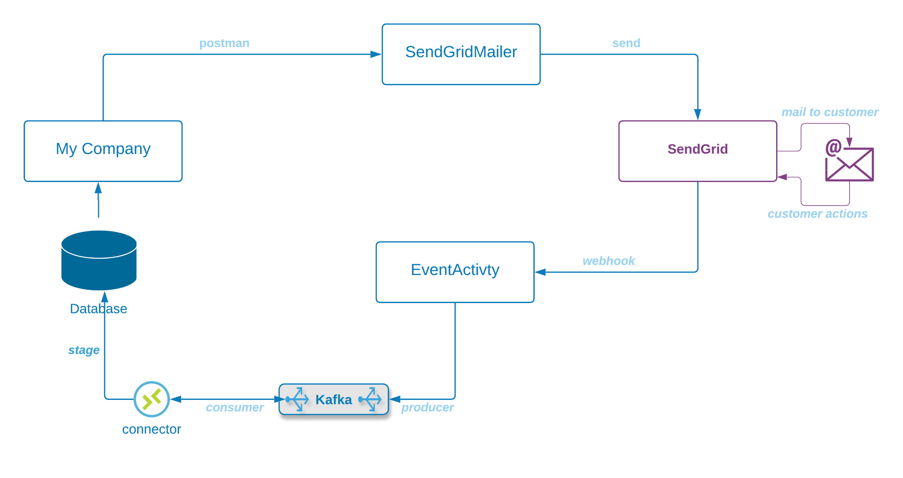

### What are we building?
- A simple pipeline consisting of two micro-services, a client to the Twilio (SendGrid) email service, and a Kafka producer and consumer to ingest callback data from Twilio

---

| componnt  | name  | description  |   |   |
|---|---|---|---|---|
| <b>SendGridMailer</b>  |  springboot-microservice | We'll build a rest-service that listens for request to send email, then formats and sends to SendGrid  |   |   |
| <b>SendGrid</b>   | n/a  | An external service owned by Twilio that sends emails on behalf of its customers  |   |   |
| <b>EventActivity</b>   |  webhook-service |  We'll also build a second rest-service that accepts callbacks from SendGrid, and sends them to Kafka.   SendGrid provides asynchronous information about how the customer interacted with the email |   |   |
| <b>Confluent</b>  | n/a  |  A high-volume message broker |   |   |
| <b>Kafka Consumer</b>   | Connector  | There are many ways to get information from Kafka to a database.  In this example we'll store the data to parquet data on AWS S3  |   |   |
