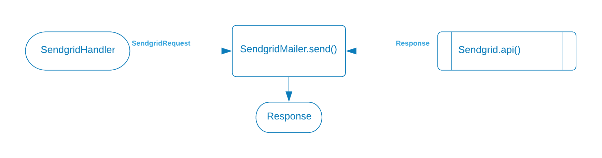

# Unit testing

## Unit testing with Junit5

### Premise

The prerequisite here is understanding of and experience with unit testing in general

The focus of the unit test is to put small component of code (the unit) under test. The value is that each unit of code
has its own contract with the rest of the code base.

Over time the definition if unit testing in business settings has not changed, but its usage and value has blurred a
bit. Originally the idea was that we would build highly reusable components that could be re-usable anywhere in the
code. And unit testing was the key instrument that could guarantee those min-contracts

Honestly in many business environments the time and organization to make that happen has never really been a top
priority. It takes a lot of time and effort and constraint to gain the level of maturity required to do it consistently,
and in most business settings the value-versus-cost just isn't there.

Unit testing is still vitally important but

we'll sometimes see the lines between unit testing and other testing (integration, functional) begin to blur a bit.
You'll hear some developers say that integration and functional testing is "more important" and It's easy to see what
they would think that way

Unit testing should not be a silo, where we write unit tests for our code without thinking through those tests as a part
of an overall plan. We do not want to be in the position where the engineer creating a functional test assumes that some
scenario "should have" been covered in unit testing

So then, practically speaking, what is unit testing? It's still our only change to verify that each unit under test can
predictably handle whatever input we throw at it. At this point we should not make assumptions about the business
scenario. I've heard some engineers say "we don't need to test that because it will never happen". That's logical in a
business context, but code changes over time and unless we can show that we have guardrails in place to guarantee that
at some future point in time the scenario that will never happen we should not make that assumption.

Unit tests are

- not relatively expensive to create
- part of what separates a hacker from a professional
- part of what separates a good solution from a bad solution
- first class citizens - a decent set of unit tests can take longer than it took to write the component under test. Plan
  for them and don't rush through them during build or in PR review

### Unit testing the controller

Testing starts with modular code design. Of course that's much easier in a textbook example like this, but the thought
process for each unit under test (method) should be the same. In this case the controller is just a simple gateway that
calls a single function to handle the input, then returns the result back to the user.

For any unit under test we first determine what and why we are testing. That includes understanding the external
dependencies that provide input into our unit. These are the variations that we want our unit to be able to handle.



In the case of the controller we have client inputs from the client that is calling the rest endpoint. And we have
process inputs because the controller is calling a handler function and needs to be able to handle whatever it gets back
from that function.

### client inputs

The SendgridController has a single endpoint with three inputs

1. The path  ("/email/v2/send")

2. The method (POST)

3. A json string

- The path can be correct or incorrect

    - correct url

    - incorrect url

The method can be POST or something incorrect

// example - bad json format

```java
class example {
    @Test
    void handles_bad_json_format() throws Exception {
        // cheese
        var expectedStatus = HttpStatus.INTERNAL_SERVER_ERROR;

        mockMvc.perform(MockMvcRequestBuilders.post("/email/v2/send")
                .contentType(MediaType.APPLICATION_JSON)
                .content("{ \"bad }")
                .accept(MediaType.APPLICATION_JSON))
                .andExpect(result -> assertEquals("Status",
                        expectedStatus.value(),
                        result.getResponse().getStatus()));
    }
}
```

### Testing requestHandler() returns

The goal of the controller is to get the user input and hand off the processing to a requestHandler function. With that
design, the only thing we need to test is how it handles the return from the requestHandler. We'll use the same pattern
as above, but we need to mock the requestHandler so that we can get the return values we want to test.

1. create a MockMvc call

2. Mock the requestHandler() to return the value we want to test

3. expect the correct http status response for that content

```java
// example - handler throws an exception
class example {
    @Test
    void handles_sendgrid_handle_exceptions() throws Exception {
        var expectedStatus = HttpStatus.INTERNAL_SERVER_ERROR;

        Mockito.when(sendgridHandler.requestHandler(anyString())).thenThrow(new RuntimeException("Bad juju"));

        mockMvc.perform(MockMvcRequestBuilders.post("/email/v2/send")
                .contentType(MediaType.APPLICATION_JSON)
                .content(content)
                .accept(MediaType.APPLICATION_JSON))
                .andExpect(result -> assertEquals("Status", expectedStatus.value(), result.getResponse().getStatus()));
    }
}
```

### Verification of the input SendgridRequest object

Since we want to test many scenarios, we'll use a parameterized test and pass several different scenarios into the same
test.

```java
class example {
    private static Stream<Arguments> payloadProvider() {
        return Stream.of(
                Arguments.of("happy_path", HttpStatus.OK, "sender", "from@gmail.com", "to@gmail.com", "subjectline", "body", Map.of(" cheese", " grater")), Arguments.of(" bad_from_address", HttpStatus.BAD_REQUEST, " sender", " from.BAD.com", " to @gmail.com ", "subjectline", "body", Map.of("cheese", "grater")),
                Arguments.of("bad_to_address", HttpStatus.BAD_REQUEST, "sender", " from @gmail.com ", " to.BAD.com ", " subjectline ", " body ", Map.of(" cheese ", " grater ")),
                Arguments.of(" empty_subject ", HttpStatus.BAD_REQUEST, "sender", "from@gmail.com", "to@gmail.com", "", "body", Map.of("cheese", "grater")),
                Arguments.of("empty_body", HttpStatus.OK, "sender", "from@gmail.com", "to@gmail.com", "subject", "", Map.of("cheese", " grater")), Arguments.of(" null_from_address", HttpStatus.BAD_REQUEST, " sender", null, " to @gmail.com ", " subjectline ", " body ", Map.of(" cheese ", " grater ")), Arguments.of(" null_to_address ", HttpStatus.BAD_REQUEST, " sender ", " from @gmail.com ", null, "subjectline", "body", Map.of("cheese", "grater")),
                Arguments.of("null_subject", HttpStatus.BAD_REQUEST, "sender"
                        , "from@gmail.com", "to@gmail.com", null, "body", Map.of("cheese", "grater")), Arguments.of("null_body",
                        HttpStatus.OK, "sender", "from@gmail.com", "to@gmail.com", "subject", null, Map.of("cheese", "grater")), Arguments.of(" null_args", HttpStatus.OK, " sender", " from @gmail.com ", " to @gmail.com ", " subject ", " body ", null)
        );
    }
}
```

blah

```java
@Captor ArgumentCaptor<Request> apiRequestCaptor;
```

Blah

```java


// example - test the sendgridMailer

/* For each argument passed in call the send() method
 * and check the that actual status code equals the expected
 * Capture the Request that we send to the SendGrid API
 * and validate the API was called correctly only when the contents were valid
 */
class example {
    @ParameterizedTest(name = "{index} => ''{0}'' - ''{1}''")
    @MethodSource("payloadProvider")
    void validates_requests_and_return_with_code_or_call_api(String message, HttpStatus expectedStatus, String sender,
                                                             String from, String to, String subject, String body, Map<String, String> custom) throws IOException { // mock the API
        lenient().when(sendGridClient.api(any(Request.class))).thenReturn(new Response(HttpStatus.OK.value(), "{}", null)); ​
        // create an input sendgridRequest based on the parameterized values passed in and set properties var mailer = new
        SendgridMailer(sendGridClient);
        mailer.apiKeyValue = this.apiKeyValue;
        mailer.host = this.host;
        mailer.apiVersion =
                this.apiVersion;
        mailer.sdkVersion = this.sdkVersion;  // call SendgridMailer::send 
        var response = mailer.send(SendgridRequest.builder()
                .senderName(sender)
                .toAddress(to)
                .fromAddress(from)
                .subject(subject)
                .content(body)
                .customArgs(custom)
                .build();
        ;  // verify the expected stats code assertThat(response.getStatusCode()).isEqualTo(expectedStatus.value());
        // if the status code is OK, then we should have caled the API // - otherwise we should have returned early and NOT
        // called the API 
        if (expectedStatus == HttpStatus.OK) {
            verify(sendGridClient).api(apiRequestCaptor.capture());
            Request
                    request = apiRequestCaptor.getValue();
            assertThat(request.getMethod()).isEqualTo(Method.POST);
            assertThat(
                    request.getBaseUri()).isNotNull();
            assertThat(request.getEndpoint()).isEqualTo(String.format("/%s/mail/send",
                    this.apiVersion));
            assertThat(request.getHeaders().getOrDefault("Authorization", "")).isEqualTo("Bearer " +
                    apiKeyValue);
        } else {
            verifyNoInteractions(sendGridClient);
        }
    }
}
  ```

​

